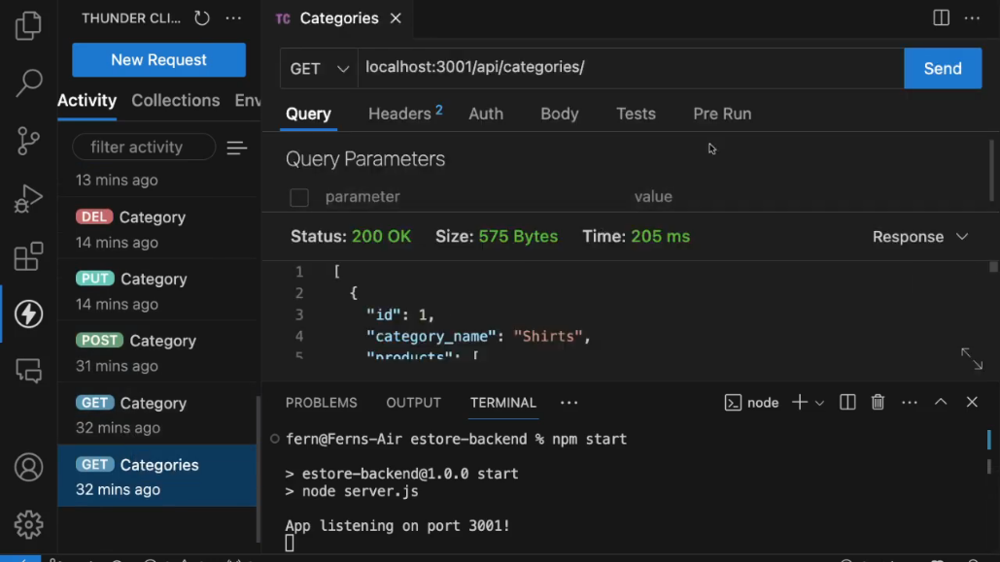

# E-Commerce Store Backend

 
 
An e-commerce backend to interface with a store database via http API.

Walkthrough:

 
## Table Of Contents
1. [Installation](#installation)
2. [Usage](#usage)
3. [License](#license)
4. [Contributing](#contributing)
5. [Tests](#tests)
6. [Questions](#questions)
 
### Installation
 
Be sure that you have Node v18.18.0 or greater installed. Check that by running `node -v` in the terminal; you should be given the version of Node currently installed. Next, clone the repository via `git clone`. Head into the repo folder and run `npm install` to install project dependencies. Head into the `seeds` folder and run `node index.js` to seed your database.
 
### Usage
 
Run the backend by running `npm start` in the repo folder. The backend will run on port 3001, so access it via Insomnia with the `http://localhost:3001` url. All API routes goes to `/api` route. For each entity (`Category`, `Product`, `Tag`) you will be able to do `GET`, `POST`, `PUT`, and `DELETE` methods on them. Doing `GET` with no id route (such as `/api/categories`) will return all instances of that entity along with its associated products or tags.
 
### License
 
 

This project in under the MIT license. Learn more about it here: https://opensource.org/licenses/MIT
 
### Contributing
 
Follow the same formatting when writing Javascript. Write descriptive commits on the features you are working on. When making a pull request, ask to merge to the `develop` branch instaed of the `main` branch.
 
### Tests
 
As mentioned in the Installation Instructions category, fill your testing database with abritrary data by running `node index.js` in the `seeds` folder. This way, you will be able to test the backend with an actual database without having to alter a production one.
 
### Questions
 
What is the link to my GitHub?
 
- Link to my GitHub profile: [https://github.com/elmfer](https://github.com/elmfer)
 
How can you contact me?
 
- Contact me through my email: [elmfer10@gmail.com](mailto:elmfer10@gmail.com)
